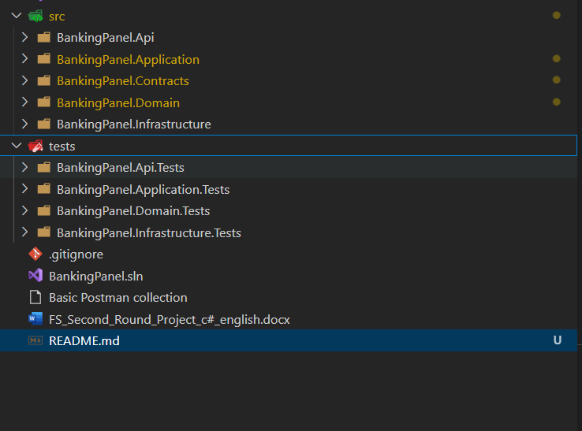

# Banking Panel


## Table of Contents

- [About the Project](#about-the-project)
- [Getting Started](#getting-started)
  - [Prerequisites](#prerequisites)
  - [Installation](#installation)


## About the Project

 a simple banking control panel tool app with basic jwt authorization implementing roles 
 a simple crud operation for client 
 a implementation of reach model Domain driven design 

**Features:**
- Basic authorization implmentation from scratch using jwt
- Onion archeticture implementation 
- Implementation of MediatR and Result pattern
- global exception handling applying rfc error documentation
- Repository pattern in practice with MediatR 
- Mapster implemtation 
- sqllite database 

## Getting Started
Application database file is aleady attached to project 
import Basic Postman collection 
register user 
login with registered user
use the token to create client and search on clients 

### Prerequisites

List the software and tools that are required.

- .NET SDK (e.g., 8.0)
- [Visual Studio](https://visualstudio.microsoft.com/) or [Visual Studio Code](https://code.visualstudio.com/)


### Installation

1. Clone the repo:
    ```bash
    git clone https://github.com/islamdraz/BankingPanelFundSouq.git
    ```
